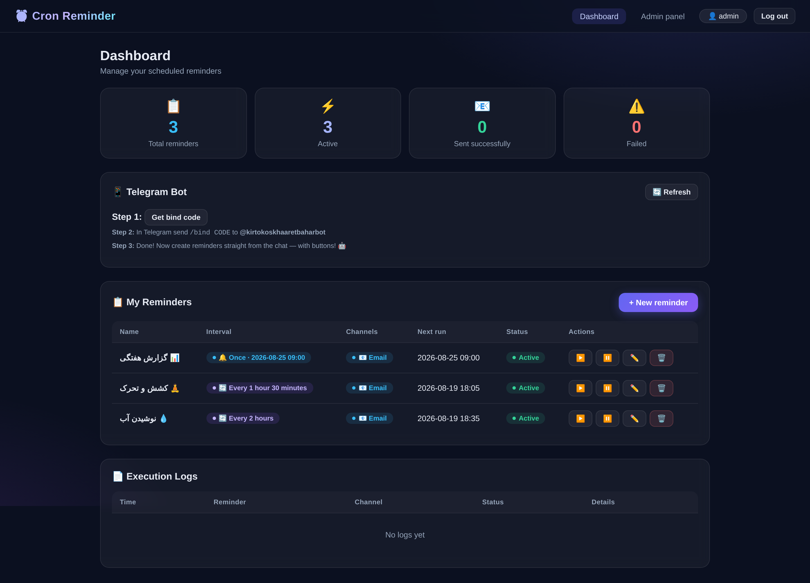
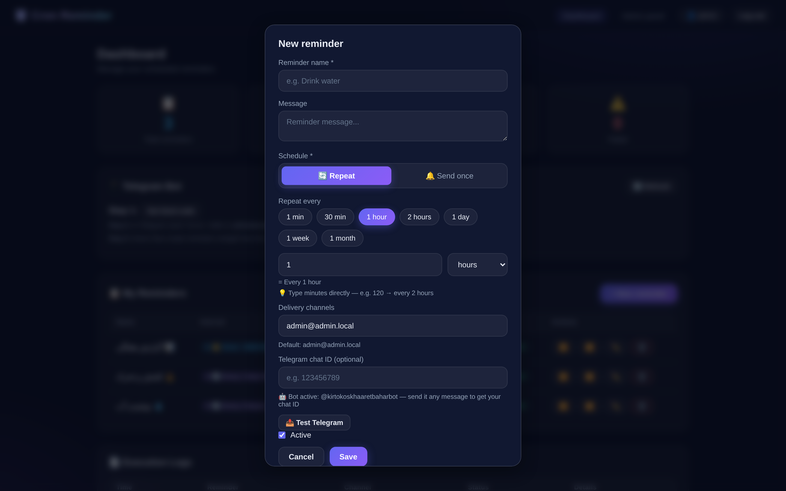
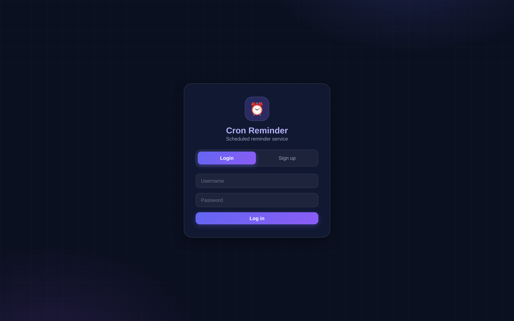
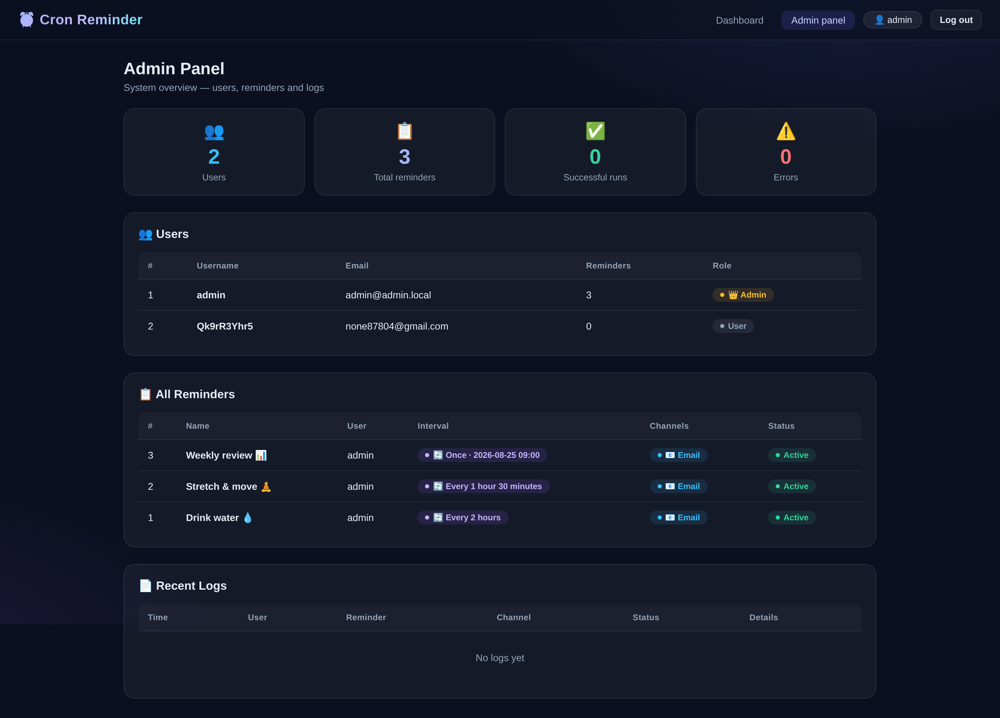
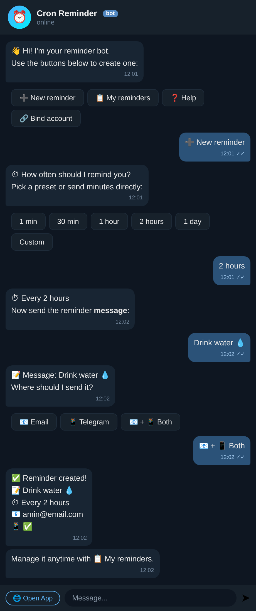

# ⏰ Cron Reminder

سرویس یادآوری زمان‌بندی‌شده: کاربران **یادآوری‌های تکرارشونده** یا **یک‌بارمصرف** می‌سازند و آن‌ها را از طریق **ایمیل** (SMTP) یا **تلگرام** دریافت می‌کنند. ساخته‌شده با FastAPI، APScheduler و aiogram، با داشبورد وب تیره و مدرن.

**نسخه زنده:** http://meow.bahari.tr

**🌐 [English README](README.md)**

---

## ✨ امکانات

- 🔐 **حساب‌های کاربری** — رمزنگاری PBKDF2 (۲۰۰ هزار تکرار)، کوکی سشن امن، محدودیت تلاش ورود (۵ بار / ۱۰ دقیقه)
- ⏱️ **دو حالت زمان‌بندی**
  - *تکرارشونده* — هر بازه‌ای از ۱ دقیقه تا چند ماه (پیش‌تنظیم + دلخواه)
  - *یک‌بارمصرف* — در زمان مشخص اجرا می‌شود و خودش خاموش می‌شود
- 📧 **ارسال ایمیل** — SMTP (جیمیل و دیگران) با قالب HTML
- 📱 **ارسال تلگرام** — بات کامل aiogram: دکمه‌های تعاملی، توقف/ادامه/حذف هر یادآوری، و فلوی ساخت هدایت‌شده (بازه ← پیام ← کانال)
- 🌐 **وب‌اپ تلگرام (Mini App)** — دکمه «Open App» در بات؛ ورود خودکار با تأیید HMAC روی `initData`، بدون نیاز به یوزرنیم/رمز
- 🧑‍💼 **پنل ادمین** — کاربران، یادآوری‌ها، لاگ‌های اجرا و آمار
- 📄 **لاگ اجرا** — موفق/ناموفق به تفکیک کانال، داشبورد زنده
- 🌍 **منطقه زمانی** — ذخیره UTC، نمایش `Asia/Tehran` (قابل تنظیم)
- ⚡ **Run now** — تست فوری یک یادآوری بدون انتظار برای اجرای بعدی
- 🛡️ **ایمنی زمان‌بند** — شناسه uid (ضد تداخل rowid)، هماهنگ‌سازی کامل زمان‌بند با دیتابیس، غیرفعال‌سازی خودکار یادآوری‌های یک‌بارمصرف قدیمی، یادآوری حذف‌شده هرگز اجرا نمی‌شود
- 📝 **لاگ فایلی** — `logs/app.log` چرخشی؛ هر ساخت/حذف/اجرا ثبت می‌شود

## 📸 اسکرین‌شات‌ها

| | |
|---|---|
|  |  |
|  |  |
|  |  |

## 🧱 استک فنی

- **بک‌اند:** Python 3.11 · FastAPI · SQLAlchemy 2.0 · APScheduler (تریگر بازه‌ای/تاریخ + croniter)
- **بات:** aiogram 3 (async، روی حلقه اصلی برنامه)
- **دیتابیس:** SQLite (فایل‌محور، قابل تغییر با `DATABASE_URL` — آماده ارتقا به PostgreSQL)
- **فرانت‌اند:** HTML/CSS/JS خالص، رابط تیره
- **استقرار:** uvicorn · systemd · nginx ریورس پراکسی

## 📁 ساختار پروژه

```
cron-reminder/
├── app/
│   ├── main.py          # اپ FastAPI — auth، jobs، logs، admin، تلگرام
│   ├── telegram_bot.py  # بات aiogram + ورود وب‌اپ (HMAC initData)
│   ├── scheduler.py     # موتور APScheduler + ارسال چندکاناله
│   ├── auth.py          # هش رمز، سشن‌ها، ساخت ادمین
│   ├── email_sender.py  # ارسال SMTP
│   ├── models.py        # User / CronJob / JobLog (+ uid پایدار)
│   ├── config.py        # تنظیمات از .env
│   ├── database.py      # engine / session
│   └── logging_setup.py # لاگ فایلی چرخشی
├── pages/               # ورود، داشبورد، ادمین — رابط انگلیسی
├── static/              # style.css + فایل‌های JS
├── scripts/             # migrate، create_admins، test_email، backup_db
├── tests/               # ۳۴ تست pytest (دیتابیس موقت، بدون ارسال واقعی)
├── requirements.txt
└── .env.example
```

## 🚀 شروع سریع

```bash
python3 -m venv venv
venv/bin/pip install -r requirements.txt

cp .env.example .env      # اطلاعات خودت را پر کن (SMTP / تلگرام / ادمین)
venv/bin/python scripts/migrate.py

venv/bin/uvicorn app.main:app --host 0.0.0.0 --port 8000
```

سپس http://localhost:8000 را باز کن.

## 👑 حساب ادمین

این مقادیر را در `.env` بگذار — حساب **به‌صورت خودکار هنگام استارت بک‌اند ساخته می‌شود** (اگر وجود داشته باشد، دست نمی‌خورد):

```ini
ADMIN_USERNAME=admin
ADMIN_PASSWORD=your-strong-password
```

اگر خالی باشند، **اولین کاربر ثبت‌نام‌شده** ادمین می‌شود.

## 📧 ایمیل (Gmail)

۱. در حساب گوگل، **تأیید دومرحله‌ای** را فعال کن
۲. یک **App Password** بساز: https://myaccount.google.com/apppasswords
۳. در `.env` قرار بده:

```ini
SMTP_USER=you@gmail.com
SMTP_PASSWORD=xxxx xxxx xxxx xxxx
```

تست: `venv/bin/python scripts/test_email.py you@example.com`

## 📱 تلگرام

۱. با [@BotFather](https://t.me/BotFather) بات بساز و توکنش را در `.env` بگذار:

```ini
TELEGRAM_BOT_TOKEN=123456:ABC...
APP_URL=https://your-domain.com
```

۲. در داشبورد یک **کد اتصال (bind)** بگیر و `/bind CODE` را برای بات بفرست
۳. یادآوری‌ها می‌توانند به ایمیل، تلگرام یا هر دو ارسال شوند — و دکمه **🌐 Open App** بات، داشبورد را با ورود خودکار باز می‌کند

## 🧪 تست‌ها

```bash
venv/bin/pip install -r requirements-dev.txt
venv/bin/python -m pytest tests/ -q
```

تست‌ها از دیتابیس موقت ایزوله استفاده می‌کنند و هرگز پیام واقعی ارسال نمی‌کنند.

## 🔌 مرور API

| متد | آدرس | توضیح |
|---|---|---|
| POST | `/api/register` | ساخت حساب |
| POST | `/api/login` · `/api/logout` | ورود/خروج |
| GET | `/api/me` | کاربر فعلی |
| POST | `/api/change-password` | تغییر رمز |
| GET/POST | `/api/jobs` | لیست / ساخت یادآوری |
| PUT/DELETE | `/api/jobs/{id}` | ویرایش / حذف |
| POST | `/api/jobs/{id}/toggle` | توقف / ادامه |
| POST | `/api/jobs/{id}/run-now` | اجرای تستی فوری |
| GET | `/api/logs` · `/api/stats` | لاگ‌ها و آمار |
| GET | `/api/telegram/status` · `/bind-code` · `/bind-status` | اتصال تلگرام |
| POST | `/api/telegram/webapp-login` | ورود خودکار وب‌اپ (HMAC) |
| GET | `/api/admin/*` | پنل ادمین (فقط ادمین) |

مستندات تعاملی (Swagger UI): `GET /docs`

## 🐳 استقرار

برنامه به‌صورت **سرویس systemd** روی `127.0.0.1:8000` و پشت nginx اجرا می‌شود:

```ini
# /etc/systemd/system/cron-reminder.service
[Unit]
Description=Cron Reminder web app
After=network.target

[Service]
Type=simple
WorkingDirectory=/root/cron-reminder
ExecStart=/root/cron-reminder/venv/bin/uvicorn app.main:app --host 127.0.0.1 --port 8000
Restart=always
RestartSec=3
Environment=PYTHONUNBUFFERED=1

[Install]
WantedBy=multi-user.target
```

```nginx
# بلاک سرور nginx
server {
    listen 80;
    server_name meow.bahari.tr;
    location / {
        proxy_pass http://127.0.0.1:8000;
        proxy_set_header Host $host;
        proxy_set_header X-Real-IP $remote_addr;
        proxy_set_header X-Forwarded-For $proxy_add_x_forwarded_for;
        proxy_set_header X-Forwarded-Proto $scheme;
    }
}
```

## 💾 پشتیبان‌گیری

`scripts/backup_db.sh` دیتابیس و `.env` را به `/root/backups/cron-reminder` کپی می‌کند (۱۴ نسخه آخر را نگه می‌دارد). به‌صورت کرون روزانه:

```cron
0 3 * * * /root/cron-reminder/scripts/backup_db.sh >> /var/log/cron-reminder-backup.log 2>&1
```
